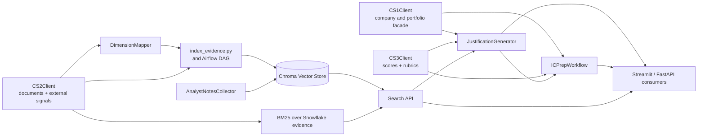
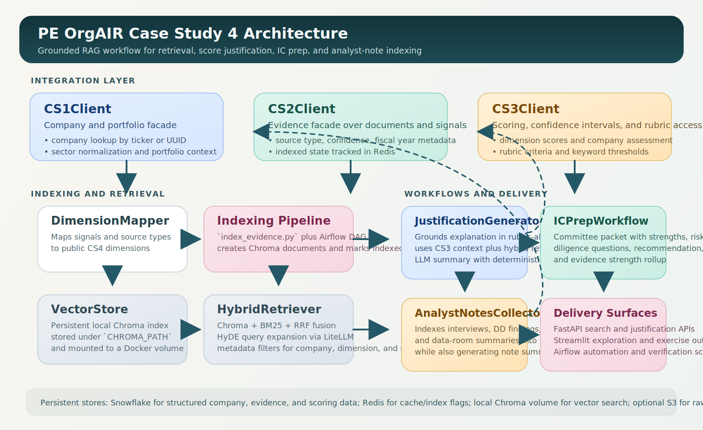

# Case Study 4 - RAG and Search

This repository contains the CS4 retrieval, search, and justification layer for the PE OrgAIR platform. The implementation connects the existing company, evidence, and scoring data stores to a grounded RAG workflow for score justification, IC prep, and analyst-note indexing.

## Deployment URLs

- Streamlit UI: `https://pe-org-ai-readiness-engine.streamlit.app/`
- Cloud Run API: `https://org-air-api-334893558229.us-central1.run.app/`
- Google Docs Codelab Source: `https://docs.google.com/document/d/1Xoq178zU-TOHQaW0H52uZ5Zor_219jSeOUuR5PVdjsE/edit?tab=t.0`
- Google Codelabs Preview: `https://codelabs-preview.appspot.com/?file_id=1Xoq178zU-TOHQaW0H52uZ5Zor_219jSeOUuR5PVdjsE`

## Deliverables Covered

- CS1 company client facade: `pe-org-air-platform/app/services/integration/cs1_client.py`
- CS2 evidence client facade: `pe-org-air-platform/app/services/integration/cs2_client.py`
- CS3 scoring client facade: `pe-org-air-platform/app/services/integration/cs3_client.py`
- Dimension mapper and hybrid retrieval: `pe-org-air-platform/app/services/retrieval/`
- Justification workflow and API: `pe-org-air-platform/app/services/justification/` and `pe-org-air-platform/app/routers/justifications.py`
- IC prep and analyst notes workflows: `pe-org-air-platform/app/services/workflows/`
- Airflow indexing DAG: `pe-org-air-platform/dags/index_evidence.py`
- Docker Compose deployment: `docker-compose.yml`
- End-to-end exercise: `exercises/complete_pipeline.py`

## Repository Layout

- `pe-org-air-platform/app`: FastAPI application, integrations, retrieval, and workflows
- `pe-org-air-platform/scripts`: operational scripts, including evidence indexing
- `pe-org-air-platform/dags`: Airflow DAGs for indexing and orchestration
- `pe-org-air-platform/streamlit`: lightweight Streamlit UI
- `pe-org-air-platform/tests`: unit and integration tests
- `pe-org-air-platform/docs/architecture.md`: architecture notes and diagram
- `exercises/complete_pipeline.py`: root-level wrapper for the required NVDA exercise

## Architecture

The main system flow is:

1. `CS1Client` resolves the company record and portfolio context.
2. `CS2Client` loads evidence from documents and external signals, preserving metadata such as source type, fiscal year, and indexed status.
3. `CS3Client` exposes dimension scores, confidence intervals, and rubric criteria.
4. `HybridRetriever` indexes evidence into Chroma, augments search with BM25 plus HyDE, and applies metadata filters.
5. `JustificationGenerator` grounds the final explanation in rubric-aligned evidence.



<p align="center">
  
</p>

If your Markdown viewer does not render Mermaid, the SVG above is the fallback. See `pe-org-air-platform/docs/architecture.md` for the detailed architecture notes.

## Setup

Prerequisites:

- Python 3.12
- Redis
- Snowflake credentials for the shared OrgAIR warehouse
- Optional LLM keys for OpenAI and/or Gemini if you want live LiteLLM-backed summaries

Recommended setup from the repository root:

```powershell
python -m venv .venv
.venv\Scripts\Activate.ps1
pip install -r pe-org-air-platform\requirements.txt
Copy-Item pe-org-air-platform\.env.example pe-org-air-platform\.env
```

Required environment variables are documented in:

- `pe-org-air-platform/.env.example`

Result export defaults:

- `RESULTS_DIR=results`
- `RESULTS_PORTFOLIO_TICKERS=NVDA,JPM,WMT,GE,DG`
- `RESULTS_UPLOAD_TO_S3=true`
- `RESULTS_LOCAL_COPY_ENABLED=true`

## Running the API

```powershell
cd pe-org-air-platform
python -m uvicorn app.main:app --reload
```

The FastAPI app exposes:

- `GET /api/v1/search`
- `POST /api/v1/justify/`
- `GET /api/v1/companies`
- `GET /api/v1/assessments`

Once the API is up, open `http://localhost:8000/docs` for the interactive OpenAPI UI.

## Running Tests

```powershell
cd pe-org-air-platform
python -m pytest
```

Optional coverage run:

```powershell
cd pe-org-air-platform
python -m pytest --cov=app --cov-report=term-missing
```

## End-to-End Exercise

The assignment's practical exercise is implemented at the repository root and delegates into the application package:

```powershell
python exercises\complete_pipeline.py --identifier NVDA --dimension data_infrastructure --top-k 5
```

What the exercise does:

1. Looks up NVIDIA through the CS1 facade.
2. Pulls the CS3 dimension score and rubric for `data_infrastructure`.
3. Loads CS2 evidence and indexes it into the CS4 vector store.
4. Generates a score justification and an IC-ready packet for the selected dimension.

Use `--json` to print the full machine-readable payload.

## Docker Compose

From the repository root:

```powershell
docker compose up --build
```

This starts:

- `rag-api` on port `8000`
- `redis` on port `6379`
- persistent Chroma storage mounted at `/data/chroma`

## Storage Locations

The repository now uses a mixed storage model by design:

- Snowflake: canonical structured records for companies, documents, chunks, signals, signal summaries, assessments, dimension scores, and `org_air_scores`
- S3: raw and exported pipeline artifacts when S3 is configured
- Local Chroma: vector index under `CHROMA_PATH`
- Local results folder: one mirrored results copy for the case-study portfolio tickers `NVDA`, `JPM`, `WMT`, `GE`, and `DG`

Local mirrored artifacts are written under:

- `pe-org-air-platform/results/NVDA/...`
- `pe-org-air-platform/results/JPM/...`
- `pe-org-air-platform/results/WMT/...`
- `pe-org-air-platform/results/GE/...`
- `pe-org-air-platform/results/DG/...`
- `pe-org-air-platform/results/PORTFOLIO/...` for portfolio-wide validation and batch summaries

By default the patched scripts now behave as follows:

- `collect_evidence.py`: Snowflake plus S3 proof artifacts, with a mirrored local `results/<ticker>/evidence/` copy for portfolio companies
- `collect_signals.py`: Snowflake plus S3 proof artifacts, with a mirrored local `results/<ticker>/signals/` copy for portfolio companies
- `compute_signal_scores.py`: Snowflake updates plus exported `results/<ticker>/signal_scores/`
- `compute_company_signal_summaries.py`: Snowflake upserts plus exported `results/<ticker>/signal_summaries/`
- `run_scoring_engine.py`: Snowflake scoring writes plus exported `results/<ticker>/scoring/`
- `index_evidence.py`: local Chroma indexing plus exported `results/<ticker>/retrieval/`
- `validate_portfolio_scores.py`: exported `results/PORTFOLIO/validation/`
- `exercises/complete_pipeline.py`: exported `results/<ticker>/cs4/`

## Airflow

The evidence indexing DAG lives at `pe-org-air-platform/dags/index_evidence.py`. It orchestrates:

1. evidence indexing
2. scoring refresh
3. smoke validation of the retrieval and justification modules

## Notes for Grading

- The repository now includes explicit CS1, CS2, and CS3 facade clients even though the backing data source in this implementation is Snowflake rather than separate external microservices.
- LiteLLM is wired into HyDE and justification summarization with deterministic fallback when provider credentials are unavailable.
- The analyst-notes workflow now supports submission and indexing of interview, DD, and data-room notes in addition to note synthesis.
